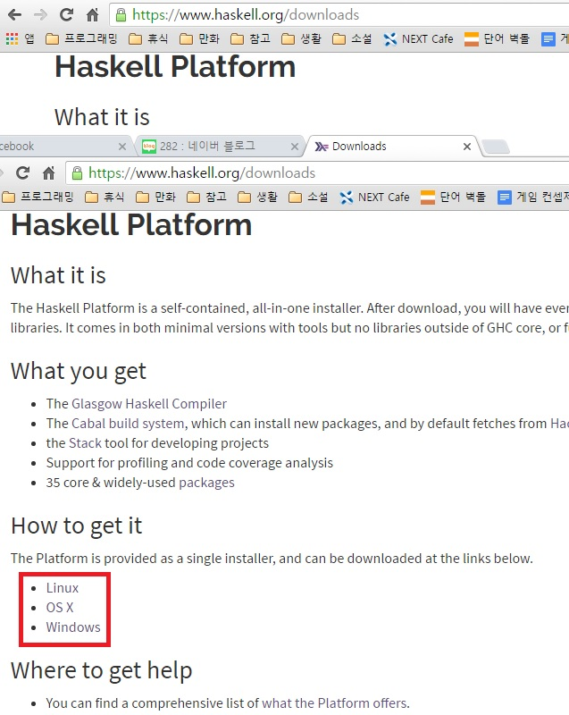

#Introduction 

우리가 여러가지 기기를 통해 사용하는 수많은 앱, 프로그램들은 다양한 종류의 프로그래밍 언어들을 통해 만들어집니다. 프로그래밍을 배워본 적 없는 사람이라도 한 번쯤은 들어봤을 법한 C/C++, Java 등등의 언어가 유명하고, 그 외에도 요즘에는 Python, Go, Rust, Swift같은 다양한 언어가 떠오르고 있죠. 그 많은 언어 중에서 어떤 언어를 배워야하는가를 고민하는 사람들은 굉장히 많습니다. 이제 갓 프로그래밍을 배우기 시작한 사람들, 그리고 이미 프로그래밍이 익숙한 사람들 모두 어떤 언어를 새로 배워야 하지? 라는 고민에서는 벗어날 수가 없지요. 그리고 이 글을 보고 계신 여러분은 그 많은 언어 중에서도 굉장히 마이너한 편에 속하는 Haskell(한국에서는 보통 **하스켈**이라는 발음으로 읽습니다. 실제 발음은 **해스켈**에 좀 더 가깝다고 합니다)이라는 언어를 한 번 배워볼까 하는 마음에 이 글을 읽고 계실겁니다.

그럼 Haskell은 다른 언어들에 비해서 어떤 장점과 단점을 가지고 있을까요? Haskell은 다른 언어와 다른 굉장히 독특한 특징들을 많이 가지고 있고 그로 인한 장점도 뚜렷합니다. 단점도 분명 많이 존재하구요. 하지만 이 자료는 Haskell의 장단점과 복잡한 개념을 하나씩 따져서 세세하게 배우는 것보다는 조금 오해의 소지가 있더라도 이해하기 쉽게, 쓰기 쉽게 배우는 것을 목표로 하고 있습니다. 그런만큼 처음부터 Haskell이 어떤 언어이고 무슨 철학을 가지고 있으며 왜 이런 문법을 가지고 있는가에 대한 내용은 설명하지 않을 생각입니다.

Haskell의 어떤 점이 좋고 불편한가? 그 건 강의 내용을 따라가며 차근차근 하나씩 배워가도록 합시다.

##프로그래밍

Haskell에 대해 본격적으로 다루기 전에 우선 프로그래밍과 관련된 기초 지식부터 짚어봅시다. 이런 기초적인 내용에 대해 잘 알고 계신 분들은 건너뛰셔도 좋습니다.

우선 프로그래밍이란 무엇일까요? 이건 말 그대로 컴퓨터에서 동작하는 프로그램을 작성하는 행위를 뜻합니다. 프로그램은 데스크탑이 됐든 스마트폰 같은 모바일 기기가 됐든 컴퓨터 위에서 돌아가는 것이죠. 이 프로그램을 작성하기 위해선 우리가 만들고 싶은 게 무엇인지 컴퓨터에게 가르쳐주어야 합니다. 사람들끼리 대화를 할 때 언어를 사용하듯이 프로그램을 짤 때에도 컴퓨터가 이해할 수 있는 언어인 기계어를 사용합니다. 하지만 이 기계어는 컴퓨터는 이해하기 쉬운 반면 사람은 이해하기가 굉장히 힘들어요. 그래서 프로그램을 짤 때는 보통 기계어를 이용해 바로 작성하지 않고, 사람이 비교적 쉽게 이해할 수 있는 수준의 언어들(위에서 언급한 C/C++, Java 등등이 되겠지요)로 프로그램을 작성한 다음 이걸 컴퓨터가 이해할 수 있는 기계어로 번역을 하죠. 이렇게 C/C++, Java 등의 프로그래밍 언어로 작성된 글을 **소스 코드(Source Code)**라고 부르고, 이 코드를 기계어로 번역하는 과정을 **컴파일(Compile)**이라고 부릅니다.

##컴파일러

당연한 이야기지만 Haskell 역시 컴퓨터가 바로 이해할 수 있는 언어가 아닙니다. 따라서 Haskell 코드를 컴퓨터가 이해할 수 있는 기계어로 번역해주는 과정(컴파일)이 필요하고, 이런 컴파일 과정을 수행해주는 프로그램을 **컴파일러(Compiler)**라고 합니다. 컴파일러도 다양한 종류가 있는데 보통 GHC(Glasgow Haskell Compiler)를 많이 씁니다. 앞으로 Haskell을 공부하기 위해서는 당연히 컴파일러가 필요하므로 미리 설치해두도록 합시다. 아래의 링크에서 자신의 OS에 맞는 Haskell Platform을 설치하시면 됩니다. Haskell Platform은 GHC뿐만 아니라 Haskell 프로그램 개발에 유용한 다양한 프로그램들을 제공해줍니다.

[https://www.haskell.org/downloads](https://www.haskell.org/downloads)  

  

위 스크린 샷의 빨간색 부분에서 자신의 OS에 맞는 것을 골라 설치하시면 됩니다.

##인터프리터

소스 코드를 컴퓨터가 이해할 수 있게 기계어로 번역해주는 과정을 컴파일이라고 한다고 했지요. 번역이라는 말에서 알 수 있듯이, 컴파일은 작성된 소스 코드의 구문을 처음부터 끝까지 모두 기계어로 변환하여 온전히 기계어로만 구성된 파일을 만들어냅니다. 반면에, 작성된 소스 코드 구문을 모조리 한 번에 기계어로 번역하는 것이 아니라 한 줄 한 줄 읽으며 그때그때 컴퓨터가 이해할 수 있게, 말하자면 **통역**을 하는 방법도 있습니다. 이것을 **인터프리트(interpret)**라고 부르고 인터프리트를 수행하는 프로그램을 **인터프리터(interpreter)**라고 부릅니다. 번역의 경우 번역을 하는데 시간이 오래 걸리는 반면 기존에 작성된 글의 의도를 비교적 정확하게 전달할 수 있고, 통역의 경우 즉각적으로 내용을 전달할 수 있는 반면 대화의 의미를 완벽하게 전달할 수는 없지요. 컴파일과 인터프리트의 관계도 이와 유사합니다. 컴파일러가 만들어내는 결과물은 컴파일을 하는데 시간이 좀 걸리는 반면 결과적으로 나온 프로그램의 성능이 더 뛰어나고, 인터프리터의 경우 컴파일을 하는데 걸리는 시간 같은게 존재하지 않고 프로그램 결과물을 실시간으로 확인하기 좋은 반면 프로그램의 수행 성능이 좀 떨어지는 편입니다. 위의 Haskell Platform을 설치하시면 Haskell 컴파일러 뿐만 아니라 인터프리터도 같이 설치됩니다. 자신이 작성한 코드가 어떻게 동작하는지 실시간으로 확인하는 것이 좀 더 재미있기 때문에 이 자료에서는 대부분 Haskell 인터프리터를 이용해서 실습을 진행하게 될 것입니다.

##에디터

일반적으로 프로그래밍을 할 때에는 각각의 언어에 맞는 적절한 에디터를 사용합니다. 메모장으로 코딩을 할 수도 있겠지만 메모장으로 하는 건 당연히 효율이 많이 떨어지겠죠. 에디터는 프로그래밍을 하는데 도움이 되는 다양한 기능을 제공해주기 때문에 자기 마음에 드는 적절한 에디터를 사용해서 코딩을 하는 것이 좋습니다. 어떤 에디터를 쓸 것인가는 거의 개인적인 취향 문제이기 때문에 이미 활용하고 계신 에디터가 있다면 그걸 계속 쓰셔도 됩니다. 어떤 에디터를 써야할 지 모르시겠다면 개인적으로는 [Visual studio Code](https://code.visualstudio.com/)나 [Brackets](http://brackets.io/)를 쓰시는 것을 추천합니다.

그럼 이제 다음 챕터부터 직접 Haskell 코드를 짜 보면서 차근차근 Haskell이라는 언어에 대해 알아가 봅시다.

 - 다음 챕터 : [IO Basic](01_IO_Basic.md)